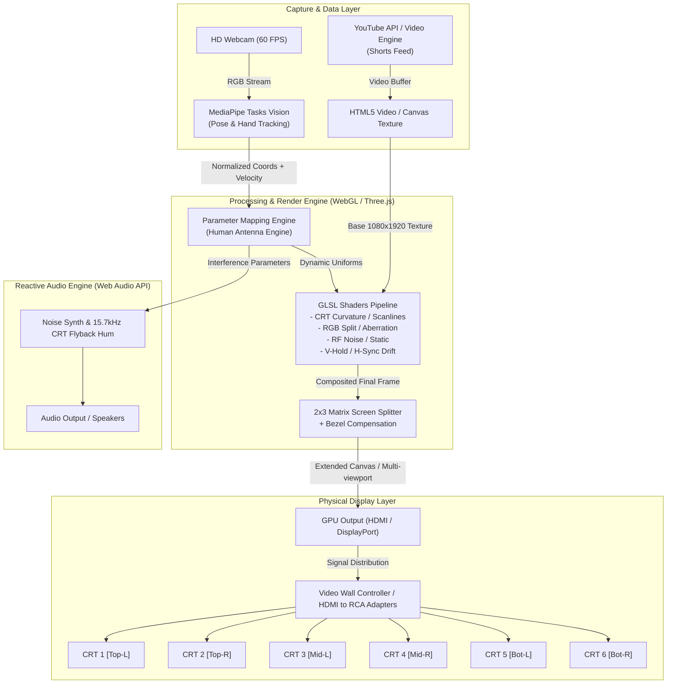
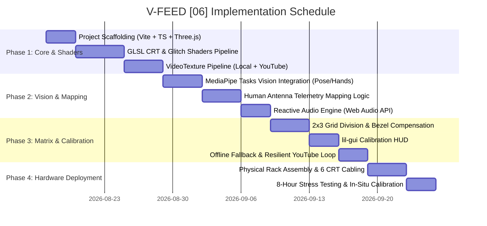

# Product Requirements Document (PRD)
## V-FEED [06] — Interactive Transmedia CRT Installation

---

| **Metadata** | **Detail** |
| :--- | :--- |
| **Project** | **V-FEED [06]** |
| **Type** | Interactive Transmedia Installation / Computational Video Art |
| **Version** | 1.0.0 |
| **Status** | Approved for Development |
| **Conceptual Reference** | [`/docs/propuesta.md`](file:///Users/mclovin/Documents/pabellon/v-feed-06/docs/propuesta.md) / Artwork by Joshua Ellingson |
| **Last Updated** | August 2026 |

---

## 1. Executive Summary & Product Vision

### 1.1. Concept
**V-FEED [06]** is a large-format transmedia art installation that contrasts the immediacy of ephemeral digital content (YouTube Shorts) with the materiality and obsolescence of analog hardware (a vertical 2×3 matrix of 6 Cathode Ray Tube - CRT monitors).

The installation inverts the viewer's traditional role: instead of functioning as a passive consumer of algorithmic vertical video feeds, the visitor's body acts as a **human antenna**. The presence, proximity, and gestures of the user tune, deform, or corrupt the video stream through analog glitches and electrical distortions emulated in real time (*glitch*, *RGB split*, *scanlines*, *V-Hold roll*, *RF electromagnetic noise*).

```
   ┌────────────────────────────────────────────────────────┐
   │                    V-FEED [06]                         │
   │                                                        │
   │   [ User / Viewer ] (Human Antenna)                    │
   │               │                                        │
   │      (Optical Tracking - MediaPipe)                    │
   │               ▼                                        │
   │   [ WebGL Engine / GLSL Shaders / YouTube Pipeline ]   │
   │               │                                        │
   │      (Mapped 1080x1920 Video Signal)                   │
   │               ▼                                        │
   │   ╔════════════════════════════════════════════════╗   │
   │   ║   CRT 1 (Top Left)     │   CRT 2 (Top Right)   ║   │
   │   ║ ───────────────────────┼────────────────────── ║   │
   │   ║   CRT 3 (Mid Left)     │   CRT 4 (Mid Right)   ║   │
   │   ║ ───────────────────────┼────────────────────── ║   │
   │   ║   CRT 5 (Bot Left)     │   CRT 6 (Bot Right)   ║   │
   │   ╚════════════════════════════════════════════════╝   │
   └────────────────────────────────────────────────────────┘
```

### 1.2. Core Objectives
1. **Aesthetic / Artistic:** Reclaim the phosphor glow, curved glass texture, and tactile warmth of CRT monitors within an industrial and computational recycling aesthetic.
2. **Interactive:** Deliver a frictionless, highly responsive interaction model with zero physical controllers or touchscreens, maintaining imperceptible end-to-end latency (< 45 ms).
3. **Technical:** Deploy a modular, robust software architecture running unattended in Kiosk Mode for 8+ continuous hours with network fault tolerance and offline caching.

---

## 2. System Architecture & Data Flow

### 2.1. Data Flow Diagram



---

## 3. Technology Stack

The project leverages a modern, high-performance web architecture optimized for local, zero-latency execution in an exhibition environment.

| Layer / Subsystem | Technology / Library | Version / Tooling | Technical Rationale |
| :--- | :--- | :--- | :--- |
| **Frontend Framework & Tooling** | **Vite + TypeScript** | Vite 5.x / TS 5.x | Instant startup, lightning-fast Hot Module Replacement (HMR), and strict typing for shader states and video pipelines. |
| **Graphics & Shader Engine** | **Three.js + Postprocessing (GLSL)** | Three.js r160+ | Low-level control over WebGL pipelines, native dynamic video texture support, custom GLSL fragment passes, and mesh/camera management. |
| **Computer Vision (Tracking)** | **Google MediaPipe Tasks Vision** | `@mediapipe/tasks-vision` (WebAssembly / WebGL) | Real-time body pose and hand landmark detection executed inside the browser thread / WebWorkers with hardware acceleration; no Python backend required. |
| **Video Pipeline & Ingestion** | **Node.js + Express / yt-dlp / YouTube Data API v3** | Node 20 LTS | Scheduled ingestion of Shorts URLs, background downloading/caching to buffer memory for zero-lag playback, and offline fallback. |
| **State Management & Events** | **Zustand / Event Emitter** | Zustand 4.x | Ultra-lightweight global reactive state to synchronize computer vision tracking data, player playback states, and GLSL shader uniforms. |
| **Audio Synthesis (Complementary)** | **Web Audio API** | Native Browser API | Procedural white/pink noise generation, 15.734 kHz flyback transformer sine whistle, and dynamic static crackles modulated by user motion. |
| **Calibration GUI / Control HUD** | **lil-gui** | lil-gui 0.19+ | Lightweight, zero-dependency floating on-screen calibration HUD for fine-tuning in gallery: camera sensitivity, glitch thresholds, color balance, and CRT bezel offsets. |
| **Kiosk Deployment & Runtime** | **Electron or Chromium Kiosk Mode + PM2** | Electron / Chrome CLI | Unattended full-screen execution, auto-boot on system startup, and auto-restart watchdog in case of crashes. |

---

## 4. Functional Requirements (FR)

### FR-01: Video Feed Ingestion & Playback (YouTube Shorts)
- **FR-01.1:** The system must dynamically query or maintain a curated playlist of YouTube Shorts via the YouTube Data API v3 or a local cache catalog.
- **FR-01.2:** Each video must loop seamlessly or auto-advance to the next Short upon reaching its completion.
- **FR-01.3 (Offline Fallback):** In the event of network disconnection, the system must immediately and transparently switch to a local directory of cached video assets without interrupting the rendering loop.
- **FR-01.4:** Video playback must be bound directly to a dynamic WebGL texture (`THREE.VideoTexture`) synchronized with the frame refresh cycle.

### FR-02: Body & Gesture Detection (MediaPipe Vision)
- **FR-02.1:** Process the incoming webcam video feed at 60 FPS (or minimum sustained 30 FPS).
- **FR-02.2:** Extract the following telemetry metrics from the viewer:
  - **Presence / Absence:** Binary detection of human occupancy within a 3-meter interaction radius.
  - **Distance / Proximities:** Estimated using bounding torso area or inter-pupillary distance.
  - **Movement Velocity:** Calculated from inter-frame positional deltas of arm and hand joints.
  - **Spatial Hand Positions (X, Y, Z):** Normalized coordinates `(0.0 to 1.0)` mapped directly to specific CRT quadrants in the 2×3 matrix.

### FR-03: "Human Antenna" Mapping Engine
- **FR-03.1 (Idle / Search Mode):** When no user is detected for > 5 seconds, the image gradually dissolves into pure analog snow noise (*RF static*) with total vertical synchronization loss (*V-Hold roll*).
- **FR-03.2 (Proximity Tuning):** As a user approaches (moving from 3m to 1m), the video signal sharpens, noise dissipates, and the video "locks" into tune.
- **FR-03.3 (Localized Hand Interference):** The user's hand coordinates `(X, Y)` cast localized electromagnetic distortion ripples onto the specific CRT monitor corresponding to where the user reaches in 3D space.
- **FR-03.4 (Velocity Fragmentation):** Rapid or violent movements trigger immediate chromatic dispersion (*RGB split*) and scanline tearing (*horizontal sync jitter*).

```
   ┌─────────────────────────────────────────────────────────────┐
   │                  VISUAL BEHAVIOR MATRIX                     │
   ├──────────────────────┬──────────────────────────────────────┤
   │ User State           │ Visual Outcome on 6 CRT Displays     │
   ├──────────────────────┼──────────────────────────────────────┤
   │ No presence (> 3m)   │ 100% White Noise (Analog TV Snow)    │
   │ Approaching (3m - 1m)│ Gradual tuning; signal locks in      │
   │ Standing still       │ Crisp picture with subtle CRT hum    │
   │ Hand gesture in air  │ Localized electromagnetic ripples    │
   │ Rapid hand motion    │ Heavy RGB split & horizontal tearing │
   │ Walking away         │ Signal fades back into white static  │
   └──────────────────────┴──────────────────────────────────────┘
```

### FR-04: GLSL Shader Pipeline (Analog CRT & Glitch Emulation)
The WebGL post-processing pipeline must execute the following configurable GLSL fragment passes:
- **Pass 1 - CRT Curvature & Barrel Distortion:** Emulates the spherical glass convexity of CRT tubes, corner vignette, and edge reflections.
- **Pass 2 - Scanlines & Phosphor Triad Grid:** Interpolated horizontal scanlines, bloom, and RGB phosphor shadow mask / aperture grille.
- **Pass 3 - Chromatic Aberration & RGB Split:** Independent spatial offset of Red, Green, and Blue channels driven by user velocity vectors.
- **Pass 4 - RF Static Noise & Analog Grain:** Gaussian white noise and pseudorandom high-frequency interference.
- **Pass 5 - V-Hold Roll & Horizontal Tape Jitter:** Cyclic vertical displacement of the frame and transient horizontal sync tears.

### FR-05: 2×3 Matrix Mapping & Bezel Compensation
- **FR-05.1:** The global rendering resolution is **1080×1920** (9:16 vertical aspect ratio).
- **FR-05.2:** The system logically splits the frame into 2 columns × 3 rows (6 quadrants of 540×640 pixels each).
- **FR-05.3 (Bezel Compensation):** Shaders must provide adjustable virtual bezel padding offsets (X and Y offsets in pixels) to ensure moving lines and objects maintain continuous geometry across the physical plastic enclosures of the 6 CRT monitors.

### FR-06: Calibration Panel & Debug HUD
- **FR-06.1:** An on-screen calibration HUD accessible via keyboard shortcut (`Ctrl + Shift + C` or `H` key) or via secondary local network browser endpoint (`http://localhost:3000/admin`).
- **FR-06.2:** Real-time adjustable parameters:
  - Camera sensitivity, confidence thresholds, and mirror mode toggles.
  - Individual shader intensity scales (scanline darkness, static gain, curvature radius, RGB split magnitude).
  - Virtual bezel compensation offsets in pixels.
  - Video source override (Live YouTube / Offline Cache / Calibration Test Grid).

---

## 5. Non-Functional Requirements (NFR)

| Code | Category | Requirement | Acceptance Metric |
| :--- | :--- | :--- | :--- |
| **NFR-01** | **Performance** | High, consistent frame rates across all active shader passes. | **≥ 60 FPS steady** at 1080×1920 resolution with all post-processing passes active. |
| **NFR-02** | **Latency** | Motion-to-photon responsiveness. | **< 45 ms** total latency from physical motion to visual output. |
| **NFR-03** | **Tracking** | Computer vision inference frequency. | **≥ 30 FPS** continuous inference on CPU/integrated GPU without degrading graphics framerate. |
| **NFR-04** | **Stability** | Continuous unattended operation in public exhibition settings. | **8+ hours continuous run** without memory leaks or WebGL context losses. |
| **NFR-05** | **Privacy** | Ethical, privacy-compliant handling of optical camera data. | **100% volatile in-memory processing on the edge**. Zero persistent storage or transmission of visitor imagery. |
| **NFR-06** | **Fault Tolerance** | System resilience against internet or service interruptions. | Automatic fallback to local cache in **< 1.0 second** upon network drop. |

---

## 6. Hardware Specifications & Physical Setup

### 6.1. Equipment List

```
                     ┌──────────────────────────────────────────────┐
                     │          HARDWARE SPECIFICATION BREAKDOWN    │
                     └──────────────────────────────────────────────┘
                                            │
        ┌───────────────────────────────────┼──────────────────────────────────┐
        ▼                                   ▼                                  ▼
[ COMPUTING UNIT ]                  [ VIDEO DISTRIBUTION ]             [ DISPLAYS & STRUCTURE ]
• Mini PC / Tower                   • 1x 2x3 Video Wall Controller     • 6x CRT TVs (14"-20")
• CPU: Intel Core i5/i7 or Ryzen 5+   or Multi-HDMI Out GPU              with Composite / RCA inputs.
• GPU: NVIDIA GTX 1660+ / RTX       • 6x Active HDMI to RCA Adapters   • Custom steel/wood industrial rack
  or Apple Silicon (M1/M2/M3)       • Shielded RCA cables                (Load capacity: ≥ 120 kg).
• RAM: 16 GB DDR4/DDR5              • Cat6 Ethernet cable              • Surge Protector / Online UPS
• Webcam: HD 1080p @ 60 FPS                                              (Electrical transient protection).
```

### 6.2. Spatial Layout & Lighting
- **Required Space:** Minimum 2.0 m width × 3.0 m depth.
- **CRT Totem Footprint:** 1.5 m (H) × 0.8 m (W) × 0.6 m (D).
- **Ambient Lighting:** Controlled, dim, or indirect lighting (50–100 lux). Avoid direct frontal lighting to prevent reflections on the curved glass surfaces of the CRT tubes.
- **Camera Placement:** Mounted top-center of the totem frame (~1.80 m height) with a 10°–15° downward tilt aimed at the interaction zone (1 to 3 meters).

---

## 7. Project Directory Structure

```
v-feed-06/
├── docs/
│   ├── propuesta.md              # Original proposal document (English)
│   └── prd.md                    # This Product Requirements Document
├── public/
│   ├── fallback-videos/         # Cached local MP4 videos for offline mode
│   └── textures/                # Phosphor mask and noise textures
├── src/
│   ├── assets/                  # CSS stylesheets and static icons
│   ├── core/
│   │   ├── App.ts               # Main lifecycle coordinator
│   │   └── StateManager.ts      # Reactive state management store
│   ├── vision/
│   │   ├── CameraManager.ts     # Webcam WebRTC video stream handler
│   │   ├── MediaPipeTracker.ts  # Pose & Hand landmark detection worker
│   │   └── GestureMapper.ts     # Maps user metrics to analog shader parameters
│   ├── rendering/
│   │   ├── SceneManager.ts      # Three.js scene, camera, and renderer setup
│   │   ├── VideoTexturePass.ts  # Video texture loader and playback loop
│   │   ├── MatrixSplitter.ts    # 2x3 grid viewport splitter & bezel offset
│   │   └── shaders/
│   │       ├── CRTShader.ts     # Barrel distortion, scanlines, phosphor mask
│   │       ├── GlitchShader.ts  # RGB chromatic split, V-Hold roll, jitter
│   │       └── NoiseShader.ts   # RF static and pseudorandom analog noise
│   ├── video/
│   │   ├── YouTubeService.ts    # YouTube Data API v3 fetcher / Shorts queue
│   │   └── VideoQueue.ts        # Playlist controller and fallback cache
│   ├── audio/
│   │   └── AudioEngine.ts       # Web Audio API (White noise + 15.7kHz CRT hum)
│   ├── ui/
│   │   ├── CalibrationHUD.ts    # lil-gui floating control interface
│   │   └── DebugView.ts         # Skeleton overlay and FPS performance graphs
│   └── main.ts                  # Application entrypoint
├── server/                      # Local Node.js proxy server
│   ├── index.ts
│   └── routes/
├── package.json
├── tsconfig.json
└── vite.config.ts
```

---

## 8. Implementation Roadmap & Milestones



### Key Milestones:
- **M1 (Visual Prototype):** GLSL CRT and glitch shaders operating at solid 60 FPS over a vertical video feed.
- **M2 (Interactive Prototype):** MediaPipe body tracking driving signal tuning, RGB split, and noise based on viewer distance and hand velocity.
- **M3 (2×3 Matrix & Splitter):** Extended viewport rendering across 6 CRT viewports with calibrated bezel compensation.
- **M4 (On-Site Deployment):** Physical installation into the vertical rack with the 6 CRT monitors, mini PC, and unattended kiosk operation.

---

## 9. Acceptance Criteria

1. **Intuitive Interaction:** Visitors understand immediately that their physical body acts as an antenna altering the TV signal without requiring text prompts or verbal instruction.
2. **Visual Authenticity:** The aesthetic on the physical CRT displays genuinely replicates analog cathode ray tube artifacts, phosphor glow, and electromagnetic interference.
3. **Operational Robustness:** The software executes reliably throughout a continuous exhibition day (8+ hours) without framerate degradation, memory leaks, or crashes.
